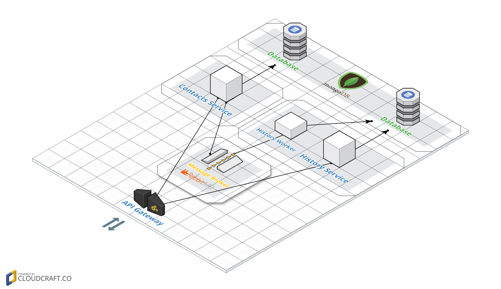

# Contacts Manager

  
  

## Architecture

# Contacts Service REST API

### /contacts/{id}
---
##### ***GET***
**Summary:** ContactsById

**Description:** Retrieve contact

**Parameters**

| Name | Located in | Description | Required | Schema |
| ---- | ---------- | ----------- | -------- | ---- |
| id | path |  | Yes | string |

**Responses**

| Code | Description | Schema |
| ---- | ----------- | ------ |
| 200 |  | [Contact](#contact) |

##### ***POST***
**Summary:** ContactsById

**Description:** Create contact

**Parameters**

| Name | Located in | Description | Required | Schema |
| ---- | ---------- | ----------- | -------- | ---- |
| id | path |  | Yes | string |

**Responses**

| Code | Description | Schema |
| ---- | ----------- | ------ |
| 201 |  | [Contact](#contact) |

##### ***DELETE***
**Summary:** ContactsById

**Description:** Delete contact

**Parameters**

| Name | Located in | Description | Required | Schema |
| ---- | ---------- | ----------- | -------- | ---- |
| id | path |  | Yes | string |

**Responses**

| Code | Description |
| ---- | ----------- |
| 204 |  |

##### ***PATCH***
**Summary:** ContactsById

**Description:** Modify contact

**Parameters**

| Name | Located in | Description | Required | Schema |
| ---- | ---------- | ----------- | -------- | ---- |
| id | path |  | Yes | string |

**Responses**

| Code | Description | Schema |
| ---- | ----------- | ------ |
| 200 |  | [Contact](#contact) |

### /contacts
---
##### ***GET***
**Summary:** Contacts

**Description:** Retrieve contacts list

**Parameters**

| Name | Located in | Description | Required | Schema |
| ---- | ---------- | ----------- | -------- | ---- |
| limit | query | Specify the amount of contacts that you want to retrieve | No | integer |
| offset | query | Specify the offset starting from which you want to retrieve contacts | No | integer |

**Responses**

| Code | Description | Schema |
| ---- | ----------- | ------ |
| 200 |  | [ [Contact](#contact) ] |

### Models
---
**Contact**  

| Name | Type | Description | Required |
| ---- | ---- | ----------- | -------- |
| id | string |  | Yes |
| name | string |  | Yes |
| email | string |  | No |
| phone | string |  | No |
